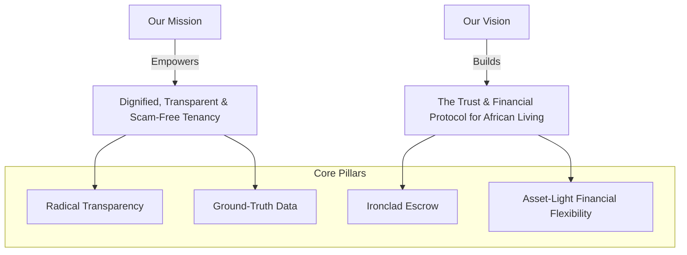

# Krent — Brand Story, Vision & Brand Identity Blueprint

> *"Keys in hand. Peace of mind. Rent without the wahala."*

---

## 1. Brand Essence & Name Origin

**Krent** was born from a fundamental intersection: **Key + Rent**.

In Nigeria, a key is never just a piece of metal. 
It is the hard-won symbol of independence for a young graduate landing their first job in Yaba; it is sanctuary for a growing family moving into a secure estate in Chevron; it is dignity, safety, and a quiet night’s sleep after five hours battling Lagos or Abuja traffic.

Yet, between wanting a home and holding the key stands an exhausting, opaque, and exploitative journey: phantom listings, quack agents demanding endless "inspection fees", predatory 20–30% markups, and properties where the tap runs brown and the road submerges at the first sign of rain.

**Krent exists to eliminate that struggle.** We turn the agonizing ordeal of renting into a seamless, trusted, and dignified mobile-first experience. 

---

## 2. The Narrative: From "House-Hunting Wahala" to Krent

### The Status Quo (The Ordeal Every Nigerian Knows)
> *“You wake up on Saturday at 6:00 AM. You’ve taken two days off work. An agent calls you to a roundabout in Ikeja. You pay ₦5,000 for 'registration' and another ₦3,000 for 'mobility'. He drives you down three unpaved streets to a dark apartment where the roof leaks and the previous tenant is still packing. When you finally find an acceptable flat, the annual rent is ₦2,000,000—but the total demand is ₦2,850,000 after 10% agency, 10% legal, caution fees, and stamp duties. You transfer the funds in panic. Two months later, the transformer blows, the borehole pump is broken, and the agent has changed his phone number.”*

### The Krent Transformation
With **Krent**, the entire dynamic is inverted:
- **Verified Ground Truth:** You open the app and filter by what actually matters in Nigeria: *Band A electricity (20+ hrs), estate diesel generator from 7 PM to 7 AM, industrial water treatment plant, and low flood risk.*
- **Zero Extortion:** You book an inspection slot. Your nominal commitment fee is protected in **escrow**—no agent gets a kobo unless they show up on time at the exact GPS coordinates.
- **Radical Price Transparency:** Total move-in costs are itemized before you leave your house. Agency and legal commissions are strictly capped at 5%. No surprise fees.
- **Escrow-Protected Handover:** You transfer your rent securely through Paystack escrow. The funds are only disbursed when you sign your digital agreement and the verified keys are in your hands.

---

## 3. Mission & Vision



### Our Mission
> **To make finding, inspecting, paying for, and living in a rental home as transparent, effortless, and dignified as ordering a ride or making a mobile transfer.**

### Our Vision
> **To become the foundational trust and financial protocol for residential living across Africa, replacing suspicion with verified contracts, guaranteed payouts, and flexible credit.**

---

## 4. The 4 Core Brand Pillars

### 1. Zero Wahala (Radical Financial Transparency)
No hidden charges, no unannounced landlord fees, no inflated quack-agent commissions. Every cost—Rent, Service Charge, Caution Deposit, Capped Agency (5%), Capped Legal (5%)—is itemized upfront. If it’s not on your Krent statement, you don’t pay it.

### 2. Truth in Concrete (Ground-Truth Living Data)
We believe renters have a right to know the unvarnished reality of a neighborhood before signing. Krent verifies what generic platforms ignore: **Disco feeder bands, estate generator schedules, water treatment clarity, and rainy season flood elevation.**

### 3. Ironclad Escrow (Trust Through Technology)
We remove fear from both sides of the transaction. Renters know their money is safe until keys are handed over; landlords and accredited agents know that bookings represent qualified, committed, identity-verified renters.

### 4. Empathy for the Hustle (Asset-Light Flexibility)
We recognize the economic reality of Nigerian salary earners and entrepreneurs. We don't take on reckless balance-sheet leasing risk; instead, we partner with regulated fintechs to offer smart **Rent-Now-Pay-Later (RNPL)** monthly installment financing, ensuring landlords receive full annual rent while tenants pay sustainably.

---

## 5. Brand Personality & Tone of Voice

| Trait | What It Means | How It Sounds |
| :--- | :--- | :--- |
| **Clear & Uncompromising** | Direct, honest, never hiding in legal fine print. | *"No hidden agency fees. 5% max, always itemized."* |
| **Calm & Reassuring** | A steady anchor amid chaotic urban house-hunting. | *"Your inspection deposit is locked in escrow. If the agent doesn't show, you're refunded instantly."* |
| **Locally Fluent & Relatable** | Deeply understands the nuances of Nigerian living without sounding unprofessional. | *"Because 'constant light' should mean 20+ hours on Band A, not a guess."* |
| **Modern & Tech-Forward** | Crisp, fast, polished mobile-first experience. | *"Book your inspection. Sign your agreement. Krent your home."* |

---

## 6. Official Slogans & Taglines

- **Master Tagline:**
  > **"Just Krent it."**
- **Brand Slogans & Positioning:**
  - *"Keys in hand. Peace of mind."*
  - *"Rent without the wahala."*
  - *"Verified homes. Transparent fees. Zero scams."*
  - *"The smartest way to rent in Nigeria."*

---

## 7. Visual Identity & Design System Tokens

```
Krent Palette
┌──────────────────────────────────────────────────────────────┐
│  Emerald Primary  │  Mint Accent  │  Obsidian Slate │ Cream  │
│     #0B3B24       │    #10B981    │     #0F172A     │#F8FAFC │
└──────────────────────────────────────────────────────────────┘
```

- **Primary Brand Color — Evergreen / Deep Emerald (`#0B3B24`):**
  Evokes trust, stability, prosperity, and the authentic green of Nigerian optimism.
- **Accent Color — Electric Mint (`#10B981`):**
  Signals speed, vitality, active verification, and modern fintech confidence.
- **Neutral Deep — Obsidian Slate (`#0F172A`):**
  Provides contrast, high legibility, and architectural solidity for cards and text.
- **Background Canvas — Soft Ice / Pure Off-White (`#F8FAFC`):**
  Clean, breathable space that keeps property photography front and center.
- **Typography:**
  - **Headings:** Plus Jakarta Sans (Bold / SemiBold) — Modern, structural, geometric.
  - **Body / Data:** Inter (Regular / Medium) — High legibility for pricing tables and attributes.
- **Iconic Mark:** A modern minimalist glyph integrating a **Keyhole** into the roofline of a **Shelter**, symbolizing immediate access and protected sanctuary.
