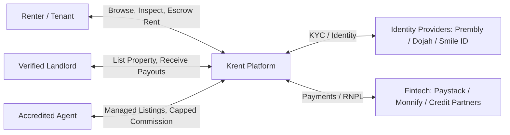

# Krent (Nigeria) — Product Scope, Architecture & Technical Specification

## 1. Executive Summary & Market Problem

The Nigerian residential rental market (particularly in high-density commercial hubs like Lagos, Abuja, Port Harcourt, and Ibadan) is plagued by deep systemic friction:
- **Exorbitant & Non-Transparent Fees:** Renters routinely face 10% legal fees, 10% agency commissions, inflated caution deposits, and repeated non-refundable "inspection fees" for dilapidated or non-existent properties.
- **Prevalent Rental Fraud & Fake Agents:** Unregistered intermediaries collect upfront rent and disappear or let a single property to multiple victims simultaneously.
- **Rigid Upfront Payment Demands:** Standard tenancy agreements mandate 1–2 years of rent upfront, conflicting with the monthly cash-flow reality of most salary earners and entrepreneurs.
- **Crucial Local Quality-of-Life Variables:** Critical amenities in Nigeria are absent from generic real estate portals: power supply reliability (Band A–D disco ratings, central diesel generator hours), flood susceptibility during the rainy season, potable/treated water availability, and gated estate security protocol.

**Krent** is designed as a trust-first, tech-enabled rental marketplace and tenancy management platform tailored specifically to the realities of Nigeria's real estate ecosystem.

---

## 2. Target Personas & Core User Roles



### 2.1 Tenant / Renter
- Fast, verified discovery without paying bogus "mobility/inspection" fees.
- Total move-in cost transparency (rent + service charge + caution + capped legal/agency fees).
- Confidence that listed properties have electricity supply, clean water, and access roads that don't submerge in July.
- Flexible payment models (annual, bi-annual, or Rent-Now-Pay-Later monthly installments).

### 2.2 Landlord / Property Owner
- Direct listing without middlemen inflating prices to pocket secret markups.
- Vetted tenant profiles with identity and income verification.
- Timely rent collection, automated tenancy renewals, and legal agreements.

### 2.3 Accredited Agent / Property Manager
- Platform for certified, honest agents (registered with ERCAAN, NIESV, or CAC verified).
- Standardized, prompt commission disbursement via automated split payments.
- Qualified leads who have already booked inspection slots with committed intent.

---

## 3. Product Scope & MVP Feature Matrix

### 3.1 Authentication & KYC Verification (Anti-Fraud Engine)
- **Tenant Auth:** Phone number + OTP (Termii SMS / WhatsApp fallback) & Biometrics (Expo LocalAuthentication).
- **Agent / Landlord KYC:**
  - Mandatory Identity Verification via **NIN** (National Identity Number) or **BVN** (via Prembly / Dojah).
  - Corporate verification for agencies via **CAC** (Corporate Affairs Commission) registration number.
  - Proof of ownership (Governor's Consent, C of O, Deed of Assignment, or Landlord Representation Mandate).
- **Trust Badges:**
  - `Verified Landlord` (Ownership documents checked).
  - `Accredited Agent` (NIN + CAC / Professional Body validated).
  - `Inspected by Krent` (Physical inspection conducted by Krent field team or geotagged video walkthrough).

### 3.2 Hyper-Local Nigerian Discovery & Filtering Engine
Listings capture Nigeria-specific attributes that dictate tenant quality of life:

| Category | Specific Attributes Tracked |
| :--- | :--- |
| **Power Infrastructure** | • Disco Feeder Band (Band A: 20+ hrs, Band B: 16+ hrs, etc.)<br>• Dedicated Estate Transformer<br>• Central Generator hours (e.g., 7 PM – 7 AM)<br>• Inverter / Solar installed<br>• "Pass your neighbor" generator allowed or prohibited |
| **Water Quality & Supply** | • Industrial Water Treatment Plant<br>• Standard Borehole vs Well Water<br>• Prepaid Water Metering<br>• Municipal Water Supply |
| **Flooding & Topography** | • Rainy season flood rating (Dry / Minor puddling / Requires high clearance / Flood-prone)<br>• Paved interlocking road vs unpaved access road |
| **Security & Estate Rules** | • Gated access control (Visitor code via app/SMS)<br>• Armed security / MOPOL / vigilante security<br>• Estate association dues (monthly/annual estimate) |
| **Financial Transparency** | • Base Rent<br>• Service Charge (diesel, security, waste collection)<br>• Caution Deposit (refundable)<br>• Legal Fee (capped at max 5–10%)<br>• Agency Commission (capped at max 5–10%)<br>• **Total Upfront Move-in Cost** calculated automatically |

### 3.3 Inspection Scheduling & Anti-Extortion Protocol
- **Issue Solved:** Elimination of illegal "registration/inspection fees" collected by street agents with no intention of leasing.
- **Krent Mechanism:**
  - Scheduled booking slots directly in-app.
  - Inspection Escrow: A nominal commitment fee (e.g., ₦2,000 – ₦5,000) is held in escrow.
  - If the agent fails to show or the listing was fraudulent, the fee is instantly refunded to the tenant and the agent's rating/badge is docked.
  - If completed, the fee is credited toward the tenant's move-in balance or split with the legitimate showing agent.

### 3.4 In-App Secure Chat & Masked Calling
- Real-time chat with landlords or verified agents (powered by Supabase Realtime or Stream Chat).
- Masked calling / audio calling via WebRTC or Twilio/Termii voice proxy to protect user phone numbers from spam and harassment.
- Direct sharing of location pins and pre-inspection questionnaires.

### 3.5 Automated Tenancy Agreement & Digital Signing
- Built-in legal templates compliant with state tenancy legislation (e.g., Lagos State Tenancy Law).
- Configurable covenants: subletting rules, notice periods (e.g., 3 months / 6 months), commercial usage restrictions.
- In-app digital signature capture for instant binding execution.

### 3.6 Payments, Escrow & Rent-Now-Pay-Later (RNPL)
- **Payment Rails:** Paystack / Monnify / Flutterwave integration supporting:
  - Instant NIP bank transfers (dedicated dynamic virtual accounts).
  - Debit cards (Mastercard, Visa, Verve).
  - USSD & Direct Debit Mandates (NIBSS e-Bills / Paystack recurring).
- **Holding Deposit Escrow:**
  - Funds are held in a secure trust escrow account until the tenant conducts the final move-in walkthrough and accepts physical keys.
  - Payouts are systematically split: Landlord receives net rent; Agent receives capped commission; Krent retains platform facilitation fee.
- **RNPL / Flexible Monthly Rent:**
  - Integration with licensed microfinance / credit partners (e.g., Carbon, Credit Direct, FairMoney) or native salary-deduction engine.
  - Landlord receives 100% full annual rent upfront; tenant pays monthly installments via automated direct debit.

---

## 4. Technical Architecture & Tech Stack

```mermaid
graph TD
    subgraph Mobile Client [Expo React Native App]
        UI[Expo Router / NativeWind v4]
        State[TanStack Query + Zustand]
        Offline[MMKV Storage]
        Media[expo-image / expo-camera]
    end

    subgraph Backend Services [Supabase / Node.js Microservices]
        Auth[Supabase Auth / Termii OTP]
        DB[(PostgreSQL + PostGIS)]
        Storage[Supabase Storage / Cloudinary]
        Realtime[Supabase Realtime / WebSockets]
        EdgeFn[Deno / Node.js Edge Functions]
    end

    subgraph External Nigerian APIs
        KYC[Prembly / Dojah: NIN / BVN / CAC]
        Pay[Paystack / Monnify: Transfers, Escrow, Splits]
        SMS[Termii: OTP & Transactional SMS]
        Maps[Google Maps / Mapbox Geocoding]
    end

    Mobile Client --> Backend Services
    Backend Services --> External Nigerian APIs
```

### 4.1 Client-Side Stack (Mobile)
- **Framework:** React Native with **Expo SDK** (Managed workflow for rapid cross-platform iOS & Android releases).
- **Language:** TypeScript (strict mode, full type-safety).
- **Routing:** `expo-router` v3+ (file-based navigation with typed routes).
- **Styling:** `nativewind` (Tailwind CSS v4 for clean, responsive UI).
- **State Management:**
  - Server state: `@tanstack/react-query` (caching, optimistic mutations, offline sync).
  - Client / UI state: `zustand` (auth tokens, search filter preferences, draft listings).
- **Local Storage:** `react-native-mmkv` for ultra-fast key-value persistence.
- **Device Features:** `expo-camera`, `expo-image-picker`, `expo-location`, `expo-notifications`, `expo-local-authentication`.

### 4.2 Backend & Data Layer
- **Core Platform:** **Supabase** (Managed PostgreSQL) or custom **NestJS** backend.
- **Geospatial Engine:** **PostGIS** extension on PostgreSQL for radius-based neighborhood searches (e.g., "Find 2-bed apartments within 5km of Admiralty Way, Lekki").
- **Row-Level Security (RLS):** Granular access policies ensuring tenants only see approved listings and agents only edit their own portfolio.
- **Media Processing:** Cloudinary or Supabase Storage with image compression, EXIF coordinate verification, and watermark stamping (e.g., "Krent Verified Property").

### 4.3 Database Schema Blueprint (PostgreSQL / Supabase)

```sql
-- Core User Profile
CREATE TABLE profiles (
  id UUID PRIMARY KEY REFERENCES auth.users(id) ON DELETE CASCADE,
  phone_number VARCHAR(15) UNIQUE NOT NULL,
  full_name VARCHAR(100) NOT NULL,
  role VARCHAR(20) CHECK (role IN ('tenant', 'landlord', 'agent', 'admin')) NOT NULL,
  verification_status VARCHAR(20) DEFAULT 'unverified' CHECK (verification_status IN ('unverified', 'pending', 'verified', 'rejected')),
  nin_hash VARCHAR(64),
  bvn_hash VARCHAR(64),
  cac_number VARCHAR(30),
  avatar_url TEXT,
  created_at TIMESTAMPTZ DEFAULT NOW(),
  updated_at TIMESTAMPTZ DEFAULT NOW()
);

-- Properties
CREATE TABLE properties (
  id UUID PRIMARY KEY DEFAULT gen_random_uuid(),
  owner_id UUID NOT NULL REFERENCES profiles(id),
  title VARCHAR(200) NOT NULL,
  description TEXT NOT NULL,
  property_type VARCHAR(50) NOT NULL, -- flat, duplex, self-contain, mini-flat, shared
  bedrooms INT NOT NULL,
  bathrooms INT NOT NULL,
  toilets INT NOT NULL,
  
  -- Financial Breakdown (in Kobo or Naira)
  annual_rent NUMERIC(14, 2) NOT NULL,
  service_charge NUMERIC(14, 2) DEFAULT 0,
  caution_fee NUMERIC(14, 2) DEFAULT 0,
  legal_fee_percentage NUMERIC(4, 2) DEFAULT 5.00,
  agency_fee_percentage NUMERIC(4, 2) DEFAULT 5.00,
  
  -- Local Nigerian Context
  power_band VARCHAR(10) CHECK (power_band IN ('Band A', 'Band B', 'Band C', 'Band D', 'Off-grid')),
  power_generator_type VARCHAR(50), -- 'Central (Estate)', 'Private Only', 'No Generators Allowed'
  water_source VARCHAR(50), -- 'Treated Borehole', 'Raw Borehole', 'State Waterworks'
  flood_risk VARCHAR(30) CHECK (flood_risk IN ('Low / Dry', 'Moderate Puddling', 'High Risk')),
  is_gated_estate BOOLEAN DEFAULT false,
  estate_name VARCHAR(150),
  
  -- Location (PostGIS)
  address TEXT NOT NULL,
  city VARCHAR(50) NOT NULL, -- Lagos, Abuja, Ibadan
  state VARCHAR(50) NOT NULL,
  neighborhood VARCHAR(100) NOT NULL, -- Lekki Phase 1, Yaba, Gwarinpa
  location GEOGRAPHY(Point, 4326),
  
  -- Media & Status
  images TEXT[] NOT NULL,
  video_tour_url TEXT,
  status VARCHAR(20) DEFAULT 'draft' CHECK (status IN ('draft', 'pending_verification', 'published', 'rented')),
  is_verified BOOLEAN DEFAULT false,
  created_at TIMESTAMPTZ DEFAULT NOW()
);

-- Inspections
CREATE TABLE inspections (
  id UUID PRIMARY KEY DEFAULT gen_random_uuid(),
  property_id UUID NOT NULL REFERENCES properties(id),
  tenant_id UUID NOT NULL REFERENCES profiles(id),
  agent_or_landlord_id UUID NOT NULL REFERENCES profiles(id),
  scheduled_time TIMESTAMPTZ NOT NULL,
  status VARCHAR(20) DEFAULT 'scheduled' CHECK (status IN ('scheduled', 'completed', 'tenant_no_show', 'agent_no_show', 'cancelled')),
  escrow_fee NUMERIC(10, 2) DEFAULT 0,
  escrow_status VARCHAR(20) DEFAULT 'held' CHECK (escrow_status IN ('held', 'refunded', 'disbursed')),
  created_at TIMESTAMPTZ DEFAULT NOW()
);

-- Tenancies & Payments
CREATE TABLE tenancies (
  id UUID PRIMARY KEY DEFAULT gen_random_uuid(),
  property_id UUID NOT NULL REFERENCES properties(id),
  tenant_id UUID NOT NULL REFERENCES profiles(id),
  landlord_id UUID NOT NULL REFERENCES profiles(id),
  start_date DATE NOT NULL,
  end_date DATE NOT NULL,
  payment_mode VARCHAR(20) CHECK (payment_mode IN ('annual_direct', 'rnpl_monthly')),
  total_paid NUMERIC(14, 2) NOT NULL,
  agreement_url TEXT,
  is_signed_by_tenant BOOLEAN DEFAULT false,
  is_signed_by_landlord BOOLEAN DEFAULT false,
  status VARCHAR(20) DEFAULT 'active' CHECK (status IN ('active', 'terminated', 'renewed')),
  created_at TIMESTAMPTZ DEFAULT NOW()
);
```

---

## 5. Mobile App Project Layout (Expo + TypeScript)

```
krent-mobile/
├── app/                          # Expo Router File-Based Routing
│   ├── (auth)/                   # Authentication flows
│   │   ├── sign-in.tsx           # Phone / Email entry
│   │   ├── verify-otp.tsx        # OTP code input (Termii)
│   │   └── kyc-verification.tsx  # NIN / BVN / CAC identity submission
│   ├── (tabs)/                   # Primary Bottom Tab Navigator
│   │   ├── _layout.tsx
│   │   ├── index.tsx             # Home feed (Featured, Localities, Quick Filters)
│   │   ├── search.tsx            # Interactive Map + Hyper-local Filter Sheet
│   │   ├── saved.tsx             # Bookmarked properties
│   │   ├── inspections.tsx       # Scheduled physical/virtual tours
│   │   └── profile.tsx           # User settings, KYC status, Tenancy dashboard
│   ├── property/
│   │   └── [id].tsx              # Detailed listing view (Cost breakdown, Power, Water)
│   ├── booking/
│   │   └── [propertyId].tsx      # Inspection date/time slot selection + escrow
│   ├── tenancy/
│   │   ├── agreement.tsx         # In-app agreement review and digital signature
│   │   └── checkout.tsx          # Paystack checkout / RNPL installment selection
│   ├── chat/
│   │   ├── index.tsx             # Message inbox
│   │   └── [conversationId].tsx  # Active conversation
│   └── _layout.tsx               # Root layout (QueryClient, AuthProvider, ThemeProvider)
├── src/
│   ├── components/               # Reusable UI Components
│   │   ├── common/               # Buttons, Inputs, Modals, Badges
│   │   ├── property/             # PropertyCard, AmenityBadge, CostBreakdownTable
│   │   └── filters/              # PowerFilter, WaterFilter, FloodRiskPicker
│   ├── features/                 # Domain-driven features (auth, properties, inspections)
│   ├── services/                 # API Clients (Supabase, Paystack, Termii)
│   ├── hooks/                    # Custom React hooks (useAuth, useLocation, useProperties)
│   ├── store/                    # Zustand stores (useAuthStore, useFilterStore)
│   ├── types/                    # Shared TypeScript interfaces & database definitions
│   └── utils/                    # Formatting (currency formatting: ₦, date utils, validators)
├── assets/                       # Icons, Splash screens, Fonts
├── app.json                      # Expo configuration
├── package.json
└── tsconfig.json
```

---

## 6. Implementation Phases & Roadmap

### Phase 1: MVP Core (Weeks 1–4)
- Expo project setup with NativeWind, TypeScript, and Navigation.
- Supabase schema deployment (PostgreSQL + RLS + Storage).
- Phone OTP Auth with Termii / Supabase Auth.
- Property listing creation (with photo uploads and Nigerian infrastructure tags).
- Property search with price range, bedroom count, and basic neighborhood filtering.

### Phase 2: Trust & Local Infrastructure Enhancements (Weeks 5–7)
- Hyper-local filter sheet (Disco power bands, treated water, flood safety rating).
- NIN / BVN verification integration via Prembly/Dojah for agents and landlords.
- Verification badges display on property cards.
- Transparent fee breakdown component (Rent + Service Charge + Caution + Legal + Agency).

### Phase 3: Engagement & Tenancy Closure (Weeks 8–10)
- Inspection booking system with commitment deposit escrow.
- In-app chat between renter and verified agent/landlord.
- Paystack / Monnify payment checkout for deposit and rent payments with automated commission splits.
- Digital tenancy agreement viewer and e-signing.

### Phase 4: Scaling & Financial Products (Post-MVP)
- RNPL (Rent-Now-Pay-Later) integration with credit providers for monthly installments.
- In-app utility payments (electricity token recharges, estate dues).
- AI rental valuation estimator based on historical neighborhood data.
