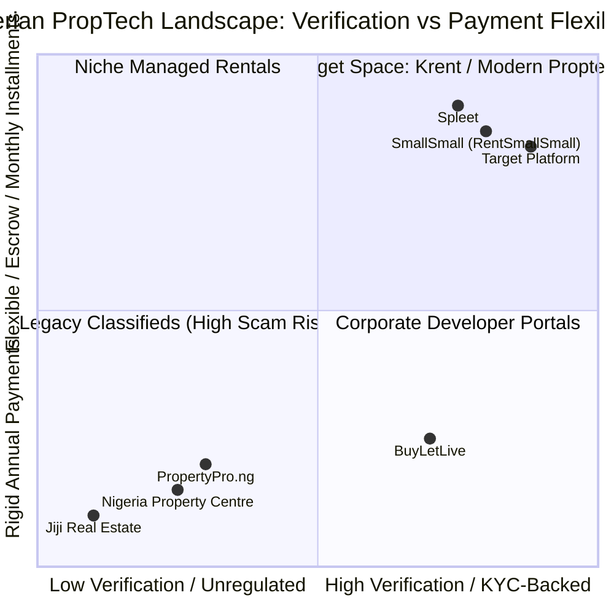

# Krent (Nigeria) — Comprehensive Market Survey, Competitive Analysis & Brand Strategy

## 1. Nigerian Rental Market Context & Opportunity

The Nigerian residential rental market—anchored in high-density urban centers such as Lagos (20M+ pop.), Abuja, Port Harcourt, and Ibadan—is estimated at over **$5B+ annually in transaction volume**, yet remains one of the least digitized, most opaque, and highly fragmented consumer sectors in Africa.

### The Systemic Trilemma:
1. **The Renter Pain:** Upfront extortion (10% agency + 10% legal + non-refundable inspection tickets) and pervasive scams.
2. **The Landlord Pain:** Chronic fear of tenant default, sluggish eviction court processes, and unreliable property managers who siphon funds.
3. **The Infrastructure Blindspot:** No existing major platform aggregates street-level livability data (feeder power bands, generator schedules, rainy season flood elevation, potable water treatment).

---

## 2. Competitive Landscape & Market Survey

### Detailed Competitor Breakdown

| Platform | Core Model | Market Penetration | Key Strengths (Pros) | Major Vulnerabilities (Cons) | Distinct Concept / Differentiation |
| :--- | :--- | :--- | :--- | :--- | :--- |
| **Nigeria Property Centre (NPC)** | Uncurated Classifieds Directory | **Very High** (Dominates SEO & Google search traffic in Nigeria) | • Massive listing inventory across all 36 states. • Direct agent phone numbers listed. • Strong brand recall for home search. | • Zero verification of agents; rampant fraud. • Fake/duplicate photos, ghost apartments. • Unregulated "inspection fees" (₦5,000–₦10,000) collected without recourse. • Outdated web-first UX. | High-volume open directory without transaction ownership. |
| **PropertyPro.ng** *(formerly ToLet)* | Classifieds + Paid Agent Promotions | **High** | • Strong mobile app footprint. • Extensive network of registered agents. • Covers long-term, short-lets, and commercial. | • Agent-favoring model: pay-to-promote allows bad actors to dominate search. • Exorbitant agency/legal fees unaddressed. • No payment escrow or online agreements. | Portal bridging renters with commercial & freelance agents. |
| **SmallSmall** *(formerly RentSmallSmall)* | Managed Inventory + Monthly Rent | **Moderate / Niche** | • True monthly payments. • Fully verified apartments. • Zero agency/legal fee exploitation. • Embedded BNPL for home appliances. | • Heavily supply-constrained (requires landlords to sign exclusivity/management). • Concentrated in high-income Lagos corridors (Lekki/Ikoyi). • High barrier to qualify tenants. | Full-stack managed tenancy with credit scoring and monthly subscriptions. |
| **Spleet** | Proptech Marketplace + RNPL (Credit) | **Moderate / Venture-Backed** ($2.6M Seed) | • Rent Now Pay Later (RNPL) financing. • Digital tenant screening & rent automation for landlords. • Clean modern digital onboarding. | • Expensive interest rates on financing. • Focus is largely premium/serviced apartments. • Limited street-level neighborhood livability data. | Fintech-first tenancy management & rental credit underwriting. |
| **BuyLetLive** | Enterprise Developer Marketplace | **Moderate** | • Developer-backed, authentic new developments. • Clean modern interface. • Verification of title documents. | • Heavy bias toward property sales and high-end rentals. • Ignored the young professional / middle-class mass rental market. | Corporate and institutional real estate marketplace. |
| **Fibre.ng** *(Defunct / Case Study)* | Master-Lease Arbitrage | **Closed / Defunct** | • Pioneered monthly renting in Lagos (2016). • Strong brand hype among tech professionals. | • **Master-lease trap:** Signed 1–2 year leases with landlords and sublet monthly. Took 100% vacancy and default risk on balance sheet. • Burned capital during macro shocks. | Subletting arbitrage (A cautionary tale: never hold master leases). |

---

## 3. Strategic Whitespace: Where the Winning Product Wins

To capture both the mass market volume of NPC and the trust of Spleet/SmallSmall, the new platform must execute on four decisive differentiators:

1. **The "Light & Flood" Index (Hyper-Local Ground Truth):**
   No platform tells a renter: *"This estate is Band A (22 hrs power), has central diesel generator from 7 PM to 7 AM, a reverse-osmosis water plant, and the access road doesn't flood in July."* This is the #1 deciding factor for Lagos/Abuja tenants.
2. **Anti-Extortion Inspection Escrow:**
   Eliminate fraudulent ₦5,000–₦10,000 "mobility fees". Tenants deposit a nominal fee into escrow that is only released when both parties check in via GPS at the property.
3. **Capped & Transparent Total Move-in Cost:**
   Automate legal (5%) and agency (5%) fee caps. The app generates the exact move-in balance sheet upfront, ending the surprise 30% add-ons at closure.
4. **Asset-Light Financial Rails:**
   Avoid Fibre’s mistake. Do not lease properties. Act as the escrow intermediary and connect tenants with regulated credit partners (Carbon, Paystack, Credit Direct) for RNPL monthly repayment.

---

## 4. Brand Audit: The Name "FindRent"

### Status & Assessment:
- **`findrent.com`**: Registered in 2002; parked/inactive with no real commercial platform.
- **`findrent.ng`**: Not an established operational tech business; only occasional generic mentions on local social media.
- **App Store / Play Store Presence**: No dominant app under this exact name, but the words "Find" and "Rent" appear in hundreds of generic keyword titles (e.g., "Find Rent Homes", "Rent Finder").

### Strategic Limitations of "FindRent":
1. **Too Generic & Keyword-Heavy:** It sounds like a search utility or classified directory rather than a trustworthy financial/property technology ecosystem.
2. **Low Trademark Distinctiveness:** Difficult to build strong, defensible brand equity and IP protection with two common dictionary verbs.
3. **Consumer Trust Gap:** Modern Nigerian consumers favor punchy, memorable, trust-evoking brand names (e.g., *PiggyVest*, *Moniepoint*, *Spleet*, *Kuda*, *Chowdeck*).

---

## 5. Curated List of Suggested Brand Names

Here is a strategic selection of alternative brand names tailored for Nigerian resonance, high recall, and global scalability:

### Category A: Trust, Security & Verification (Highlighting Anti-Fraud)
| Name | Brand Narrative & Meaning | Domain & Vibe |
| :--- | :--- | :--- |
| **VeriRent** / **VeraRent** | From *Veritas* (Truth) + Rent. Directly communicates verified listings, verified agents, and zero scams. | `verirent.ng` / `verirent.app` (Authoritative, trustworthy) |
| **TrueRent** | Signals honest pricing, capped commissions, real photos, and no surprise charges. | `truerent.ng` / `truerent.africa` (Direct, clean) |
| **RentSecure** | Emphasizes escrow-protected inspections and deposits. | `rentsecure.ng` (Fintech-grade trust) |

### Category B: Modern, Punchy PropTech (Short, Memorable, App-Store Ready)
| Name | Brand Narrative & Meaning | Domain & Vibe |
| :--- | :--- | :--- |
| **Krent** | Blend of **Key** + **Rent** (or "Clean Rent"). Single syllable, crisp, tech-forward like Kuda or Klarna. | `krent.ng` / `krent.app` (Modern, fast, punchy) |
| **Sheltr** | Modern, vowel-dropped spelling of *Shelter*. Evokes safety, living well, and human-centric living. | `sheltr.ng` / `sheltr.app` (Lifestyle proptech) |
| **Habita** | From Latin *habitare* (to dwell/live). Sophisticated, expansive, easily scales across Africa. | `habita.ng` / `habita.africa` (Premium, reliable) |
| **RentPass** | Positions the app as a "digital passport" to renting—pre-verified KYC, pre-approved rent financing, seamless move-in. | `rentpass.ng` / `rentpass.app` (Product-led, active) |

### Category C: Culturally Resonant & Welcoming (Deep Nigerian Warmth)
| Name | Brand Narrative & Meaning | Domain & Vibe |
| :--- | :--- | :--- |
| **IleMi** | Yoruba for *"My Home"* (Ilé Mi). Resonates deeply with the psychological pride of securing a great home. Universal warmth across Nigeria. | `ilemi.ng` / `ilemi.app` (Authentic, deeply memorable) |
| **Cribba** | Nigerian slang adaptation of "Crib". Highly relatable to tech-savvy youth, Gen Z, and upwardly mobile millennials. | `cribba.ng` / `cribba.app` (Friendly, accessible) |
| **KeyNest** | Evokes finding a safe nest and receiving the physical keys with joy. | `keynest.ng` (Warm, comforting) |

---

## 6. Recommended Top 3 Names for Launch

1. 🥇 **Krent** — Best for a sleek, high-growth mobile fintech/proptech hybrid (short, punchy, easily brandable as "Krent it").
2. 🥈 **VeriRent** — Best for directly conquering the market's biggest fear: unverified agents and listing scams.
3. 🥉 **IleMi** — Best for building an authentic, community-loved Nigerian brand with immense emotional connection.

---

## 7. Formal Brand Selection: Krent

**Selected Name:** **Krent**
- **Brand Origin:** Blend of **Key** + **Rent** (Unlocking seamless, verified shelter).
- **Phonetics:** Single syllable, sharp, modern, memorable (comparable to modern fintechs like Kuda, Klarna, Stripe).
- **Conversational Usage:** *"Just Krent it"*, *"Found my new flat on Krent"*, *"Rent without the wahala"*.
- **Detailed Brand Architecture:** Detailed in [BRAND_STORY.md](file:///Users/ajibolagenius/Desktop/Krent/BRAND_STORY.md).

