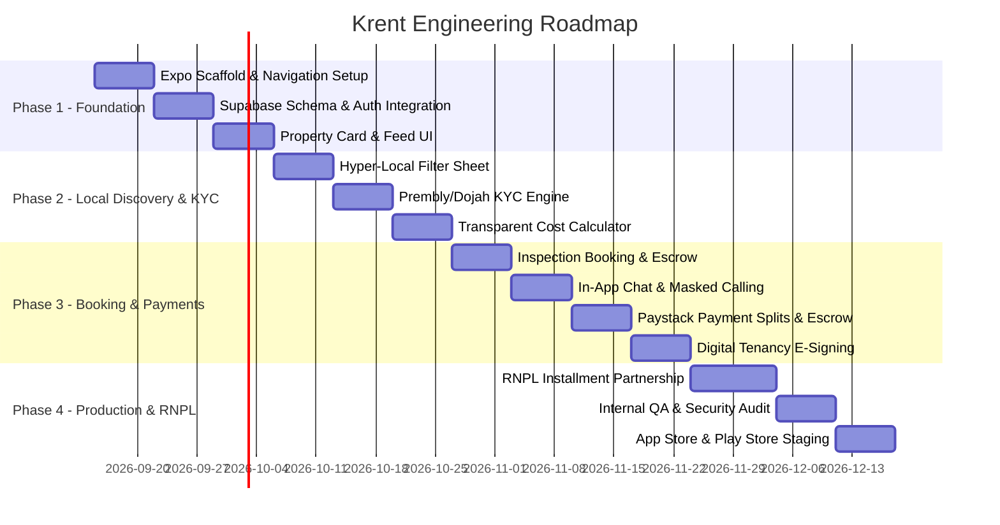

# Krent (Nigeria) — Implementation Roadmap & Integration Guide

This document defines the engineering sprints, third-party Nigerian API integration playbooks, and deployment milestones for the **Krent Mobile App** (React Native / Expo + Supabase).

---

## 📅 Sprint Breakdown & Delivery Milestones



---

## 🛠 Phase Details & Action Items

### Sprint 1: Project Scaffolding & Design System
- Initialize Expo app with TypeScript: `npx create-expo-app@latest krent-mobile --template blank-typescript`.
- Configure `expo-router` for file-based navigation (tabs + modal stacks).
- Configure `nativewind` (Tailwind CSS v4) with Nigeria-first tokens:
  - Brand Primary (Emerald/Green palette reflecting Nigerian trust & growth).
  - Typography: Inter / Plus Jakarta Sans.
  - Custom Currency Formatter: `formatNaira(amount: number)`.
- Configure `@tanstack/react-query` and `zustand` stores.

### Sprint 2: Database, RLS & Authentication
- Execute [DATABASE_SCHEMA.sql](./DATABASE_SCHEMA.sql) on Supabase.
- Integrate **Termii** SMS OTP service for Nigerian carrier delivery (+234 MTN, Airtel, Glo, 9mobile).
- Implement biometric authentication (FaceID / Fingerprint) using `expo-local-authentication`.
- Build user role selector during onboarding (`Looking to Rent` vs `Landlord / Accredited Agent`).

### Sprint 3: Nigerian Hyper-Local Discovery
- Implement Home screen feed with categories:
  - "Band A Power (20+ Hours)"
  - "Gated Estates Only"
  - "Flood-Proof Terrain (Dry Island / Mainland)"
  - "Furnished Mini-Flats"
- Build Filter Sheet with real-time reactive counts:
  - Price Range (₦500,000 – ₦15,000,000+).
  - Power options: Generator schedule, Inverter/Solar, Disco Band.
  - Water options: Industrial Treatment vs Treated Borehole.
  - Drainage & Access: Paved interlock vs unpaved.
- Property Details screen with the **Total Move-in Cost Table** (Rent + Service Charge + Caution + Legal (5%) + Agency (5%)).

### Sprint 4: Identity Verification & Anti-Fraud (KYC)
- Integration with **Prembly (Smile ID)** or **Dojah**:
  - Verification of NIN with live selfie match.
  - BVN validation for landlords/agents receiving escrow disbursements.
  - CAC RC-number lookup for verified corporate realty agencies.
- Automated badge assignment (`Verified Landlord`, `Accredited Agent`).
- Watermarked listing upload system preventing image theft from other platforms.

### Sprint 5: Inspection Booking & Escrow Protection
- Calendar booking system allowing tenants to select 30-minute inspection slots.
- Holding deposit mechanism: ₦2,000–₦3,000 inspection commitment held in escrow.
- Geolocation check-in: Tenant and Agent both confirm arrival at the property coordinates to release payment.
- Fraud penalty system: Automatic suspension and escrow forfeiture for "no-show" fake agents.

### Sprint 6: In-App Chat, Tenancy & Payment Rails
- Real-time messaging between prospective tenants and landlords/agents via Supabase Realtime.
- Standardized Lagos/Nigeria digital tenancy agreement generator.
- **Paystack Integration:**
  - Dedicated virtual bank account generation for NIP transfers.
  - Split payouts: e.g. 90% to Landlord, 5% to Agent, 5% platform fee.
  - Rent holding escrow: funds disbursed only after physical move-in confirmation.

---

## 🔌 Nigerian Third-Party API Specifications

### 1. Identity Verification (Prembly / Smile ID / Dojah)
```typescript
// Sample KYC Verification Request
interface VerifyAgentKYC {
  nin: string;
  dob: string;
  selfieImageBase64: string;
  cacNumber?: string; // Optional for individual agents
}

// Endpoint: POST /api/kyc/verify-identity
// Verifies user's National Identity Number against NIMC database
```

### 2. SMS / OTP Delivery (Termii Nigeria)
```typescript
// Payload for Termii SMS Gateway
const sendTermiiOtp = async (phoneNumber: string, otpCode: string) => {
  const formattedPhone = phoneNumber.startsWith('+234') 
    ? phoneNumber.replace('+', '') 
    : `234${phoneNumber.replace(/^0/, '')}`;
    
  return fetch('https://api.ng.termii.com/api/sms/send', {
    method: 'POST',
    headers: { 'Content-Type': 'application/json' },
    body: JSON.stringify({
      to: formattedPhone,
      from: 'Krent',
      sms: `Your Krent verification code is ${otpCode}. Valid for 10 minutes.`,
      type: 'plain',
      channel: 'generic',
      api_key: process.env.TERMII_API_KEY,
    }),
  });
};
```

### 3. Payment Processing & Split Payouts (Paystack)
```typescript
// Paystack Subaccount Split Initialization
interface PaystackSplitPayload {
  email: string;
  amount: number; // In Kobo (₦100,000 = 10,000,000 kobo)
  reference: string;
  split: {
    type: 'percentage';
    bearer_type: 'account';
    subaccounts: [
      { subaccount: string; share: number }, // Landlord (e.g. 90%)
      { subaccount: string; share: number }  // Agent (e.g. 5%)
    ];
  };
}
```

---

## 🔒 Security & NDPR (Nigeria Data Protection Regulation) Compliance

1. **Personally Identifiable Information (PII):**
   - NIN and BVN numbers must never be stored in plain text. Always store one-way cryptographic SHA-256 hashes (`nin_hash`, `bvn_hash`) alongside verification verification IDs issued by Prembly/Dojah.
2. **Escrow Safeguards:**
   - Client funds must never touch unsecured operational company accounts. They must be routed through a licensed settlement trust bank or dedicated Paystack escrow subaccount.
3. **Audit Trail:**
   - All inspection bookings, check-in timestamps, geolocation coordinates, and payment transfers are permanently logged with audit timestamps.
