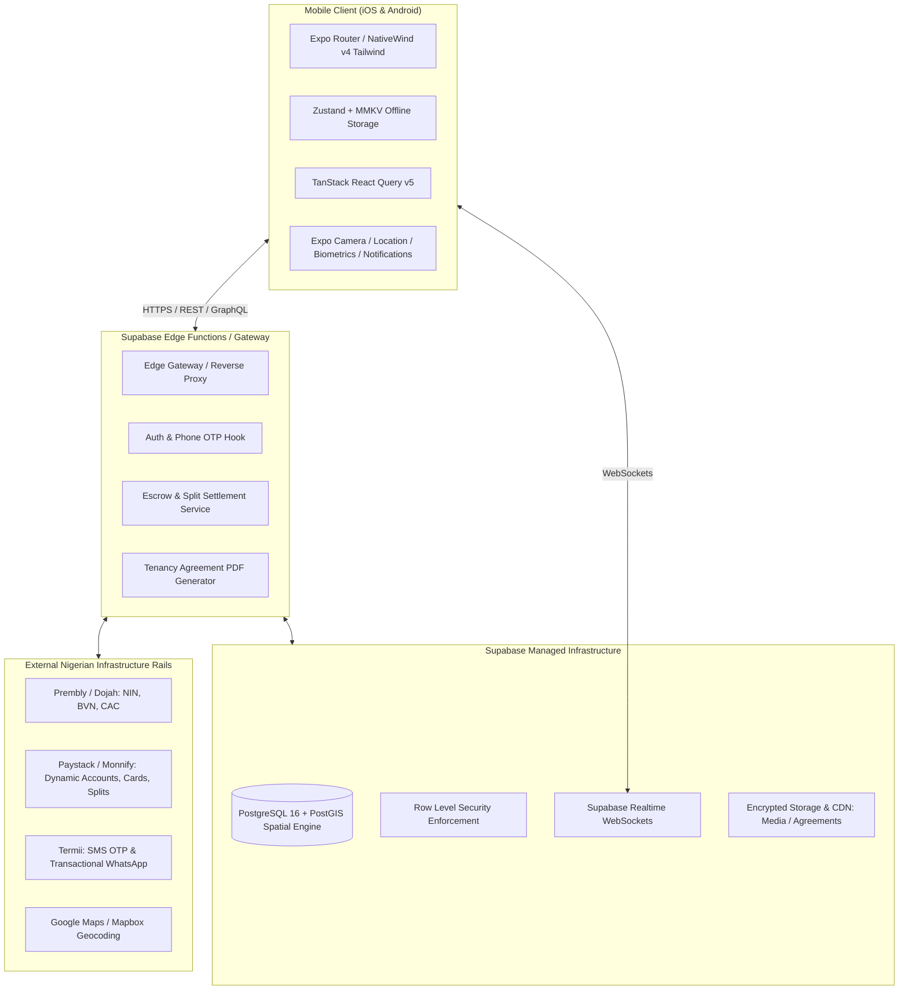
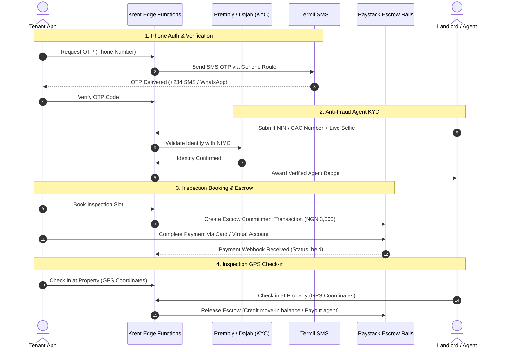
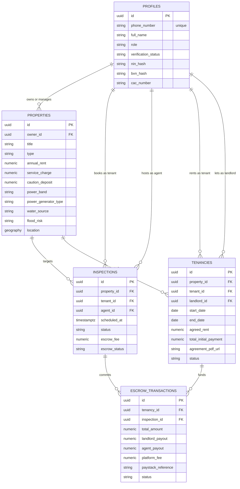
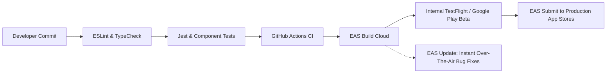

# Krent — Comprehensive Technology Stack & Architecture Blueprint

This document defines the complete engineering architecture, technology selection rationale, data flow, third-party integrations, and DevOps pipelines for the **Krent Mobile Platform** (iOS & Android).

---

## 1. High-Level Architecture Overview



---

## 2. Detailed Technology Selection & Stack Matrix

### 2.1 Mobile Client Stack

| Layer | Technology | Version | Rationale & Trade-offs |
| :--- | :--- | :--- | :--- |
| **Framework** | **React Native + Expo** | SDK 52+ (Managed) | Rapid cross-platform releases for iOS and Android; Hermes engine enabled by default for near-instant Time-To-Interactive (TTI). |
| **Language** | **TypeScript** | 5.3+ (Strict Mode) | End-to-end type safety shared with backend database schema definitions; zero runtime type regressions. |
| **Routing** | **Expo Router** | v4 | File-based, deeply linkable routing matching Next.js paradigms; first-class support for native stacks, tabs, and modals. |
| **Styling & Design System** | **NativeWind** | v4 (Tailwind CSS) | Zero-runtime CSS-in-JS overhead; shared responsive design tokens across mobile screens and future web dashboards. |
| **Icons Library** | **Phosphor Icons React Native** | v6.1.2 | Open-source icon library for product design systems. |
| **Server State & Caching** | **@tanstack/react-query** | v5 | Automatic background refetching, cache invalidation, and optimistic UI updates for instant booking interactions. |
| **Client / Local State** | **Zustand** | v4.5+ | Minimalist, unopinionated global state (auth session, search filter drafts) with zero boilerplate. |
| **Offline Key-Value Store** | **react-native-mmkv** | v2.12+ | C++ backed key-value persistence, up to 30x faster than standard AsyncStorage; used for session tokens and cached search filters. |
| **Image Handling** | **expo-image** | Latest | Memory-efficient image pipeline with native caching, BlurHash placeholders, and WebP decoding for slow mobile networks. |
| **Device Hardware APIs** | **Expo Native Modules** | SDK 52 | • `expo-location`: Geofenced inspection check-ins.<br>• `expo-camera` / `expo-image-picker`: In-app property photography and KYC selfie capture.<br>• `expo-local-authentication`: Biometric login (FaceID / Fingerprint).<br>• `expo-notifications`: Push notifications for inspection status and escrow releases. |

---

### 2.2 Backend & Data Tier (Supabase BaaS + Edge Functions)

| Component | Technology | Rationale & Implementation Details |
| :--- | :--- | :--- |
| **Relational Database** | **PostgreSQL 16** | Robust relational model guaranteeing ACID compliance for financial escrow transactions and tenancy covenants. |
| **Geospatial Engine** | **PostGIS Extension** | Spatial indexing (`GIST`) enabling radius-based searches (e.g. *"Properties within 5km of Lekki Toll Gate"* via `ST_DWithin`). |
| **Data Security & Isolation** | **Row Level Security (RLS)** | Granular database-level permission rules enforcing that renters only view published properties and agents only manage their own portfolio. |
| **Realtime Messaging** | **Supabase Realtime** | WebSocket channels delivering instantaneous in-app messages between tenants and agents, and live inspection status changes. |
| **File Storage & CDN** | **Supabase Storage** | S3-compatible asset store with image transformation for watermarked listing photos, floor plans, and signed tenancy agreements. |
| **Serverless Compute** | **Deno / TypeScript Edge Functions** | Low-latency serverless edge workers handling third-party webhooks (Paystack payments, Termii delivery), PDF contract rendering, and cron tasks. |

---

### 2.3 Third-Party Integrations (Nigeria-First Financial & Data Rails)



1. **Identity & Anti-Fraud Verification (Prembly / Smile ID / Dojah):**
   - **NIN (National Identity Number):** Validates the agent/landlord's legal identity against the NIMC database with biometric facial liveness matching.
   - **BVN (Bank Verification Number):** Validates account names for automated settlement payouts.
   - **CAC (Corporate Affairs Commission):** Validates registered real estate companies and brokerage firms.

2. **Payment Rails & Escrow Orchestration (Paystack / Monnify):**
   - **Dedicated Virtual Accounts (Dynamic NIP):** Instant bank transfer generation for each tenancy and inspection transaction.
   - **Card Payments:** Direct processing of Nigerian debit cards (Mastercard, Visa, Verve).
   - **Paystack Subaccounts & Split Payments:** Automated multi-split payout upon move-in key handover:
     - 90% Net Rent → Landlord subaccount.
     - 5% Capped Commission → Verified Agent subaccount.
     - 5% Platform Fee → Krent operational account.
   - **Holding Escrow Account:** Funds are locked in a designated settlement trust until tenant submits physical key confirmation.

3. **Telecommunications & Transactional Alerts (Termii):**
   - **High-priority transactional SMS:** Direct carrier routing across MTN, Airtel, Glo, and 9mobile for 99.5% OTP delivery within 5 seconds.
   - **WhatsApp Business API Fallback:** Automatic failover to WhatsApp if SMS delivery fails due to DND (Do Not Disturb) restrictions.

4. **Digital Tenancy Agreement Generation:**
   - Edge Function utilizing `pdf-lib` to dynamically populate standardized Nigerian tenancy covenants (Lagos State Tenancy Law compliant).
   - In-app canvas signature capture stored as cryptographic SVG/PNG embedded in the executed PDF.

---

## 3. Data Model & Entity Relationship Architecture



---

## 4. Mobile Client Codebase Structure (`krent-mobile`)

```
krent-mobile/
├── app/                          # Expo Router (File-Based Navigation)
│   ├── (auth)/                   # Authentication Group
│   │   ├── sign-in.tsx           # Phone number input
│   │   ├── verify-otp.tsx        # Termii OTP input
│   │   └── kyc-onboarding.tsx    # Role selection & NIN/BVN capture
│   ├── (tabs)/                   # Main Tab Navigator
│   │   ├── _layout.tsx           # Tab Bar Configuration
│   │   ├── index.tsx             # Home feed (Categories, Top Localities)
│   │   ├── search.tsx            # Interactive Map + Hyper-Local Filters
│   │   ├── saved.tsx             # Wishlist / Bookmarked Listings
│   │   ├── inspections.tsx       # Scheduled & Upcoming Tour Manager
│   │   └── profile.tsx           # Account Settings, KYC Badges, Leases
│   ├── property/
│   │   └── [id].tsx              # Detailed Property View + Cost Breakdown
│   ├── booking/
│   │   └── [propertyId].tsx      # Inspection Scheduling & Escrow Checkout
│   ├── tenancy/
│   │   ├── agreement.tsx         # In-App Digital Tenancy E-Signing
│   │   └── payment.tsx           # Paystack Virtual Account / Card Checkout
│   └── _layout.tsx               # Root Layout (QueryClient, AuthProvider)
├── src/
│   ├── components/               # Atomic Design UI Components
│   │   ├── ui/                   # Button, Input, Modal, BottomSheet, Badge
│   │   ├── property/             # PropertyCard, PriceTag, InfrastructureGrid
│   │   └── filters/              # PowerBandFilter, FloodRiskPicker, PriceSlider
│   ├── features/                 # Domain Modules
│   │   ├── auth/                 # Auth hooks, context, state
│   │   ├── properties/           # Property queries, mutations, geo-search
│   │   ├── inspections/          # Inspection bookings, GPS check-in
│   │   └── payments/             # Escrow payments, Paystack hooks
│   ├── services/                 # API Clients (Supabase, Paystack, Termii)
│   ├── store/                    # Zustand global stores (useAuth, useFilters)
│   ├── types/                    # Shared TypeScript interfaces & Supabase DB types
│   └── utils/                    # Naira currency formatters, date formatters
├── assets/                       # Brand icons, custom fonts, splash screens
├── app.json                      # Expo Application Configuration
├── tailwind.config.js            # NativeWind v4 design tokens
├── package.json
└── tsconfig.json
```

---

## 5. Security, Cryptography & Compliance Standards

1. **NDPR (Nigeria Data Protection Regulation) Compliance:**
   - Sensitive government identifiers (NIN, BVN) are never stored in raw text format.
   - The backend computes and stores salted **SHA-256 hashes** (`nin_hash`, `bvn_hash`) used solely for duplicate detection.
   - User facial selfies are securely routed directly to Prembly/Dojah via transient memory buffers and deleted after verification confirmation.

2. **Escrow Financial Safeguards:**
   - Platform escrow accounts operate under a designated settlement trust structure.
   - All state mutations for escrow funds require idempotent transaction references generated via cryptographic UUIDs to prevent double-spending or duplicate disbursements.

3. **Mobile Anti-Tamper & Fraud Defense:**
   - **EXIF Verification:** Listing photos uploaded by agents are checked for original device EXIF metadata and GPS coordinates to verify that the agent physically visited the unit.
   - **Listing Image Hashing:** Perceptual hashing (pHash) algorithm detects duplicate photos uploaded across multiple accounts to eliminate fake copycat listings.

---

## 6. DevOps, Build & Deployment Pipeline



- **Build System:** **EAS (Expo Application Services) Build** running on dedicated macOS and Linux cloud runners.
- **Continuous Integration (CI):** GitHub Actions enforcing strict TypeScript compilation, ESLint, and Prettier formatting on every pull request.
- **Over-the-Air (OTA) Updates:** **EAS Update** enabled for instant delivery of JavaScript bundle patches, bug fixes, and seasonal UI updates directly to user devices without App Store review delays.
- **Crash & Performance Monitoring:** **Sentry** SDK integrated on mobile for real-time stack traces, network latency profiling, and crash rate alerting.
